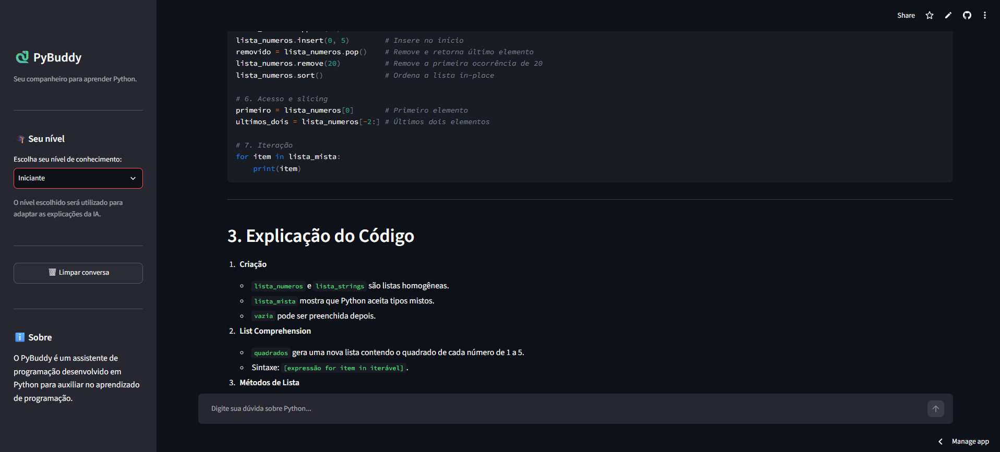

# 🐍 PyBuddy

### Seu companheiro para aprender Python

O **PyBuddy** é um assistente de programação desenvolvido em Python
para auxiliar estudantes no aprendizado de programação.

A aplicação utiliza **Streamlit** para a interface e a **Groq API**
para gerar as respostas do assistente.

## 🖥️ Demonstração



## 🚀 Acesse o projeto

👉 **[Testar o PyBuddy online](https://jlsnogueira247-pybuddy-app-eov8w8.streamlit.app/)**

## ✨ Funcionalidades

- 💬 Conversação com o assistente de programação
- 🧠 Histórico da conversa durante a sessão
- 🎓 Respostas adaptadas ao nível do usuário
- 🛡️ Tratamento de erros durante a comunicação com a API
- 🗑️ Limpeza do histórico da conversa
- 📚 Indicação de documentação oficial
- 🔐 Uso de variável de ambiente para proteger a API Key

## 🛠️ Tecnologias

- Python
- Streamlit
- Groq API
- python-dotenv
- Git
- GitHub

## 📁 Estrutura do projeto

```text
PyBuddy/
├── app.py
├── prompts.py
├── .gitignore
└── requirements.txt
```


## 🚀 Como executar
```markdown
### 1. Clone o repositório
```

```bash
git clone URL_DO_REPOSITORIO
cd PyBuddy
```
```markdown
### 2. Crie um ambiente virtual
python -m venv .venv
```
```markdown
### 3. Ative o ambiente virtual

No Windows:

.venv\Scripts\activate
```
```markdown
### 4. Instale as dependências

pip install -r requirements.txt
```
```markdown
### 5. Configure a API Key

Crie um arquivo **.env** na raiz do projeto:

GROQ_API_KEY=sua_chave_aqui

⚠️ Importante: nunca compartilhe sua API Key ou publique o arquivo .env.
```
```markdown
### 6. Execute a aplicação

streamlit run app.py
```
## 📚 Origem do projeto

O PyBuddy teve como ponto de partida um estudo de caso desenvolvido
durante o curso gratuito *Fundamentos de Linguagem Python - Do Básico a Aplicações de IA*, da
Data Science Academy.

A partir da implementação inicial, o projeto foi reorganizado e
evoluído, recebendo uma nova identidade e funcionalidades como
histórico de conversas, seleção de nível de conhecimento, tratamento
de erros e melhorias na interface.


## 👩‍💻 Autora

**Joana Nogueira**

Estudante de Engenharia da Computação, com interesse em dados, 
programação e tecnologia.
